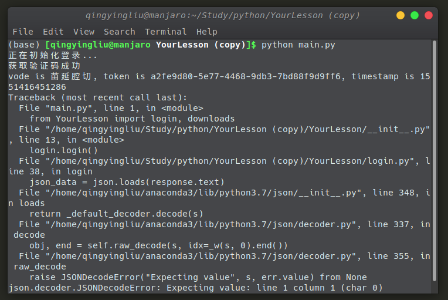

# YourLesson

YourLesson是针对深圳大学的选课系统进行抢课的，这里只需要几分钟的配置即可使用。

## 下载

`git clone https://github.com/Lewin671/YourLesson.git`

## 设置帐号和密码等参数
在YourLesson包里面有一个`setting.py`文件，里面设置好你的参数。参数的含义如下：
* USER_ID: 用户帐号
* PASSWORD： 用户密码
* VODE_URL和HEADERS无需配置，不要动它。
* DELAY: 抢课的间隔，单位是毫秒。建议不要低于200ms，不然可能会把服务器搞跨，会出事的。
* COUNT： 抢课的次数。

## Python环境配置
该项目已经带有了一个虚拟环境，我们只需要激活它即可。在终端使用如下命令进行激活（此时应该是在项目的根目录）:
`. venv/bin/activate`

如果不能使用，请自行用pip下载相关库。
```
Package    Version   
---------- ----------
certifi    2018.11.29
chardet    3.0.4     
idna       2.8       
pip        19.0.3    
requests   2.21.0    
setuptools 40.8.0    
urllib3    1.24.1    
wheel      0.33.1  
```

## 运行抢课程序
先下载不冲突、不满的课程到data文件夹，以便后面的操作。
`python download_data.py`

在终端中使用`python main.py`可运行单门抢课程序。运行程序的时候要用到课程编号，请用户到时候自行在data文件夹用excel等用具查找。

如果想要使用批量抢课，那么你应该使用`multiple_choose.py`，并按照规定的格式进行填写`courses`列表。

## issue

如果在运行中有任何问题，可以邮箱我:`2596736318@qq.com`

## 常见问题
如果遇到如下的情况，请确认在setting.py文件下的帐号和密码是否正确。


## 抢课成功的界面

如果在终端中提示你抢课成功，那么恭喜你，你抢到了这门课。结果如下：
