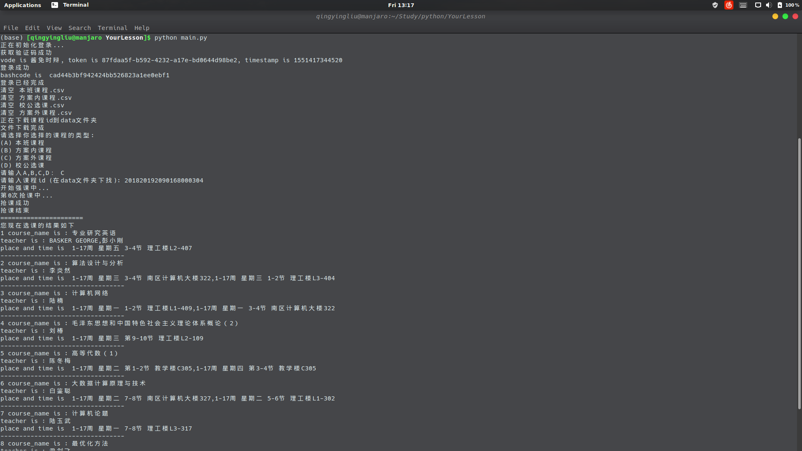

# YourLesson

YourLesson是针对深圳大学的选课系统进行抢课的，这里只需要几分钟的配置即可使用。

## 下载

`git clone https://github.com/Lewin671/YourLesson.git`

## 设置帐号和密码等参数
在YourLesson包里面有一个`setting.py`文件，里面设置好你的参数。参数的含义如下：
* USER_ID: 用户帐号
* BATCH：　登陆后找到recommendedCourse.do的header，复制electiveBatchCode赋值给BATCH
* Cookie: 登陆后找到recommendedCourse.do的header，赋值Cookie到此处。
* token: 登陆后找到recommendedCourse.do的header，复制token到此处。
* DELAY: 抢课的间隔，单位是毫秒。建议不要低于200ms，不然可能会把服务器搞跨，会出事的。
* COUNT： 抢课的次数。

## Python环境配置
相关ｐython库如下
```
Package    Version   
---------- ----------
certifi    2018.11.29
chardet    3.0.4     
idna       2.8       
pip        19.0.3    
requests   2.21.0    
setuptools 40.8.0    
urllib3    1.24.1    
wheel      0.33.1  
```

## 运行抢课程序
先自己在网页上提前登录，然后赋值cookie到setting.py文件。

下载课程信息到data文件夹，以便后面的操作。
`python download_data.py`

（不建议)在终端中使用`python main.py`可运行单门抢课程序。运行程序的时候要用到课程编号，请用户到时候自行在data文件夹用excel等用具查找。

如果想要使用批量抢课，那么你应该使用`multiple_choose.py`，并按照规定的格式进行填写`courses`列表。
其中courses的格式如下:
```
# 注： 
# 本班课程： 'TJKC'
# 方案内课程: 'FANKC'
# 方案外课程： 'FAWKC'
# 校公选课： 'XGXK'
# 慕课: "ＭOOC"，
# 辅修课程: "FXKC"，
# 体育课程:"TYKC"
courses =[
    {'id':'201920201190114000103','type':'FXKC','name':"解析几何(徐希)"},
    {'id':'201920201990008000101','type':'MOOC','name':"拓展英语词汇"},
    {'id':'201920201990039000101','type':'MOOC','name':"走进性科学"},
]
```


## issue

如果在运行中有任何问题，可以邮箱我:`2596736318@qq.com`

## 常见问题
**该程序需要提前在网页上登录**，复制网页上的信息设置好setting.py文件后下载课程数据(download_data.py)，然后设置multiple_choose.py里面courses变量的信息，提前设置程序改选择哪些课程。

设置完毕后，运行multiple_choose.py程序。

## 抢课成功的界面

如果在终端中提示你抢课成功，那么恭喜你，你抢到了这门课。结果如下：
