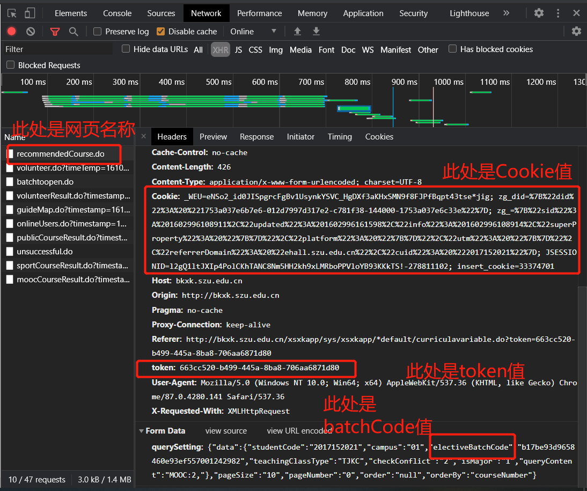

# YourLesson

YourLesson是针对深圳大学的选课系统进行抢课的，这里只需要几分钟的配置即可使用。

## 下载

`git clone https://github.com/Lewin671/YourLesson.git`

## 设置帐号和密码等参数
在`setting.py`文件，里面设置好你的参数。参数的含义如下：
* user_id: 学号
* electiveBatchCode：　登陆后找到recommendedCourse.do的header，复制electiveBatchCode
* Cookie: 登陆后找到recommendedCourse.do的header，赋值Cookie到此处。
* token: 登陆后找到recommendedCourse.do的header，复制token到此处。
* delay: 抢课的间隔，单位是毫秒。建议不要低于200ms，不然可能会把服务器搞跨，会出事的。
* count: 抢课的次数。

## Python环境配置
相关pthon库如下
```
Package    Version   
---------- ----------
certifi    2018.11.29
chardet    3.0.4     
idna       2.8       
pip        19.0.3    
requests   2.21.0    
setuptools 40.8.0    
urllib3    1.24.1    
wheel      0.33.1  
```
注意是`python3`，有些电脑在终端中输入`python`默认使用`python2`，那么这时您可以输入`python3`而不只是`python`。


## 运行抢课程序
1. 下载课程信息到data文件夹，以便后面的操作。
   `python download_data.py`
   下载完课程相关数据后，您就可以在`data`文件夹下查看相关课程信息。并且您需要根据这些信息来配置`setting.py`文件。
2. 先自己在网页上提前登录，然后配置setting.py文件。相关字段的查找如下图所示（谷歌浏览器）:
   
其中courses的格式如下:
    ```python
    # 注： 
    # 本班课程： 'TJKC'
    # 方案内课程: 'FANKC'
    # 方案外课程： 'FAWKC'
    # 校公选课： 'XGXK'
    # 慕课: "ＭOOC"，
    # 辅修课程: "FXKC"，
    # 体育课程:"TYKC"
    courses =[
        {'id':'201920201190114000103','type':'FXKC','name':"解析几何(徐希)"},
        {'id':'201920201990008000101','type':'MOOC','name':"拓展英语词汇"},
        {'id':'201920201990039000101','type':'MOOC','name':"走进性科学"},
    ]
    ```
3. 配置完`setting.py`后，只需要在当前目录下运行`python3 main.py`就可以开始抢课了。

## issue

如果在运行中有任何问题，可以邮箱我:`2596736318@qq.com`

## 常见问题
**该程序需要提前在网页上登录**，复制网页上的信息设置好setting.py文件后下载课程数据(download_data.py)，然后设置`setting.py`里面courses变量的信息，提前设置程序改选择哪些课程。

设置完毕后，运行`main.py`程序。

同时也不要忘记设置学号(user_id)哦！！！

## 抢课成功的界面

如果在终端中提示你抢课成功，那么恭喜你，你抢到了这门课。结果如下：
